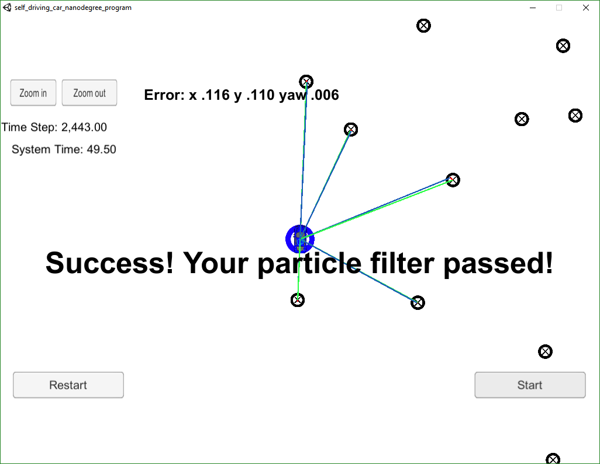

# Particle Filter Localization Project

## Overview

This repository contains all the code needed to complete the third project for the Localization course in Udacity's Self-Driving Car Nanodegree.

#### Submission

This repository in its entierty forms the submission for this project.  The files ```particle_filter.cc``` and ```particle_filter.h``` contain the meat of the particle filter, while there were some additions to ```helper_functions.h``` and minor modifications to ```main.cpp```.  This code, specifically the ```particle_filter```, follows the Google Style Guide for C++.  The additions to the other files follow the style of the pre-exisiting code.

## Project Introduction

The robot has been kidnapped and transported to a new location! Luckily it has a map of this location, a (noisy) GPS estimate of its initial location, and lots of (noisy) sensor and control data.

In this project I implement a 2 dimensional particle filter in C++. My particle filter is given a map and some initial localization information (analogous to what a GPS would provide). At each time step my filter will also get observation and control data. 

## Running the Code
This project involves the Term 2 Simulator which can be downloaded [here](https://github.com/udacity/self-driving-car-sim/releases)

This repository includes two files that can be used to set up and intall uWebSocketIO for either Linux or Mac systems. For windows you can use either Docker, VMware, or even Windows 10 Bash on Ubuntu to install uWebSocketIO.

Once the install for uWebSocketIO is complete, the main program can be built and ran by doing the following from the project top directory.

1. mkdir build
2. cd build
3. cmake ..
4. make
5. ./particle_filter

Alternatively some scripts have been included to streamline this process, these can be leveraged by executing the following in the top directory of the project:

1. ./clean.sh
2. ./build.sh
3. ./run.sh

Tips for setting up your environment can be found [here](https://classroom.udacity.com/nanodegrees/nd013/parts/40f38239-66b6-46ec-ae68-03afd8a601c8/modules/0949fca6-b379-42af-a919-ee50aa304e6a/lessons/f758c44c-5e40-4e01-93b5-1a82aa4e044f/concepts/23d376c7-0195-4276-bdf0-e02f1f3c665d)

Note that the programs that need to be written to accomplish the project are src/particle_filter.cpp, and particle_filter.h

The program main.cpp has already been filled out, but feel free to modify it.

Here is the main protcol that main.cpp uses for uWebSocketIO in communicating with the simulator.

INPUT: values provided by the simulator to the c++ program

// sense noisy position data from the simulator
```
["sense_x"] 
["sense_y"] 
["sense_theta"] 
```
// get the previous velocity and yaw rate to predict the particle's transitioned state
```
["previous_velocity"]
["previous_yawrate"]
```
// receive noisy observation data from the simulator, in a respective list of x/y values
```
["sense_observations_x"] 
["sense_observations_y"] 
```

OUTPUT: values provided by the c++ program to the simulator

// best particle values used for calculating the error evaluation
```
["best_particle_x"]
["best_particle_y"]
["best_particle_theta"] 
```
//Optional message data used for debugging particle's sensing and associations for respective (x,y) sensed positions ID label 
```
["best_particle_associations"]
```
// for respective (x,y) sensed positions
```
["best_particle_sense_x"] <= list of sensed x positions
["best_particle_sense_y"] <= list of sensed y positions
```

If the code is successful the output says:

```
Success! Your particle filter passed!
```

# Implementing the Particle Filter
The directory structure of this repository is as follows:

```
root
|   build.sh
|   clean.sh
|   CMakeLists.txt
|   README.md
|   run.sh
|   sim.png
|   sim2000.png
|
|___data
|   |   
|   |   map_data.txt
|   
|   
|___src
    |   helper_functions.h
    |   main.cpp
    |   map.h
    |   particle_filter.cc
    |   particle_filter.h
```

## Inputs to the Particle Filter
You can find the inputs to the particle filter in the `data` directory. 

#### The Map*
`map_data.txt` includes the position of landmarks (in meters) on an arbitrary Cartesian coordinate system. Each row has three columns
```
1. x position
2. y position
3. landmark id
```

### All other data the simulator provides, such as observations and controls.

> * Map data provided by 3D Mapping Solutions GmbH.

## Results


## Accuracy
Does your particle filter localize the vehicle to within the desired accuracy?
The accuracy of the particle filter was calculated from the difference between the ground truth and the estimator result for each time step.

The final error achieved by the particle filter of size 100 after 2,443 time steps was:

| Pose | Error |
|-------|-----|
| x (meters) | 0.116 |
| y (meters) | 0.110 |
| yaw (rad) | 0.006 |

The number of particles was chosen to be 100.  This provided good estimates without slowing the processing time too much.  More particles, did show a slight decrease in the x,y position error, but not the yaw error. The maximum particle count that did not exceed the time limit was 2000 particles and can be seen in ```sim2000.png```. Lowering the particle count to 10 particles significantly increased the x and y errors.

## Performance
Does your particle run within the specified time of 100 seconds?

The simulation took 49.5 seconds to complete, which was well below the threshold of 100 seconds.  Unfortunately this number also has a lot to do with the processor capability, but it should give a good ball park value of perfmance.  It is most useful when used as a metric on the same machine between subsequent runs when testing different optimizations.


## Particle Filter
Does your code use a particle filter to localize the robot?
The particle filter implemented in this project consists of 4 main steps:

### Initialization

Using the initial guess which comes from a noisy GPS measurement and the vehicle heading from an inertial sensor an arbitrary number of particles are created at this pose with random Gaussian noise specific to the known standard deviations of the sensors.

## Prediction

Using the vehicle estimate yaw rate from gyrometers and the velocity from the car the predicted position for each particle is propagated forward based on the time delta and the appropriate sensor noise is added.

## Update

Using the predicted locations of all the particles and a set of observations of landmarks from the cars radar/lidar sensors and an existing known map of the landmarks each particle associates the measurements with the closest predicted landmarks and a weight is assigned based on a multivariate normal distribution.

## Resample

A new set of particles is sampled with replacement from the original set according to the weighted distribution.  This means that are still the original number of arbitrary particles but now they better represent the Baysian posterior.  These particles are then fed back into the prediction step if any new landmark observations come in.


